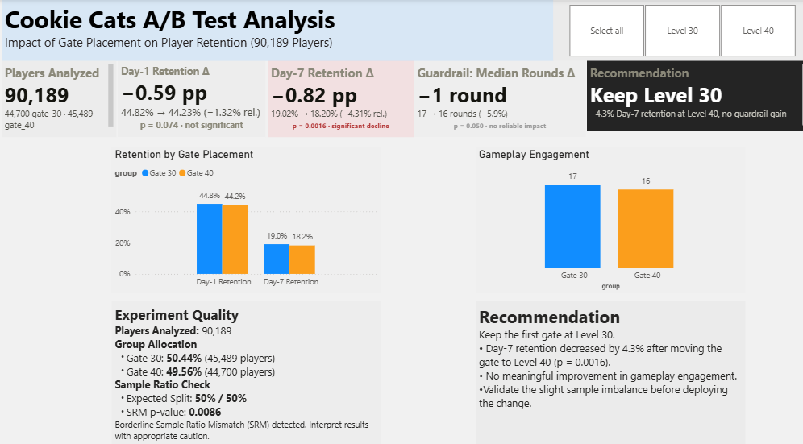

# Cookie Cats A/B Test Analysis

Should Tactile Entertainment move the first progression gate in *Cookie Cats*
from level 30 to level 40? A full statistical analysis of a real 90,189-player
mobile game A/B test — hypothesis testing, guardrail-metric analysis, and a
one-page executive Power BI dashboard.



---

## Project Overview

This project analyzes a randomized controlled experiment from the mobile game
*Cookie Cats*, where the first "gate" (a progression wall that pauses the
player) was moved from level 30 to level 40 for a random half of players. The
goal is to determine, rigorously, whether that change affected player
retention — and to communicate the answer in a form a product manager or
hiring manager can act on in under a minute.

The project is split into two deliverables:
1. A **Jupyter notebook** carrying the full statistical analysis, phase by
   phase, with every conclusion backed by an explicit test, assumption check,
   and effect size — not just a p-value.
2. A **Power BI dashboard** that presents the same numbers as a clean,
   single-page executive report, with every value traceable back to the
   notebook.

## Business Problem

> **Should the first gate stay at level 30, or move to level 40?**

Moving a monetization/progression gate later in a game is a common design
lever: it could help retention (less friction early) or hurt it (more
investment lost when players do quit at the wall). Cookie Cats' team ran a
live A/B test to settle this empirically rather than by intuition. This
project reproduces and extends that analysis to give a defensible,
statistically grounded recommendation.

## Dataset

- **Source:** [Cookie Cats A/B Testing](https://www.kaggle.com/datasets/mursideyarkin/mobile-games-ab-testing-cookie-cats) — Kaggle, real production data from Tactile Entertainment
- **Size:** 90,189 players, one row per player
- **Columns:** `userid`, `version` (`gate_30` / `gate_40`), `sum_gamerounds` (rounds played), `retention_1`, `retention_7` (Day-1 / Day-7 return flags)
- **Quality:** verified in Phase 1 — no missing values, no duplicate users, no out-of-range values

## Objectives

1. Verify the experiment's data quality and randomization before trusting any comparison (Sample Ratio Mismatch check).
2. Test whether gate placement affects Day-1 and Day-7 retention, with confidence intervals and effect sizes, not just significance.
3. Test whether gate placement affects a **guardrail metric** (`sum_gamerounds`) — so a retention change isn't read in isolation from overall engagement.
4. Separate statistical significance from practical, business-relevant significance.
5. Turn the result into one clear, appropriately-hedged recommendation.

## Tech Stack

| Layer | Tools |
|---|---|
| Analysis | Python 3.11, pandas, numpy |
| Statistics | scipy, statsmodels |
| Visualization (notebook) | matplotlib, seaborn |
| Environment | Jupyter Notebook |
| Dashboard | Power BI Desktop |
| Version control | Git / GitHub |

## Repository Structure

```
cookie-cats-ab-testing-analysis/
├── README.md
├── requirements.txt
└── project-B-cookiecats-ab/
    ├── data/
    │   └── raw/
    │       └── cookie_cats.csv          # raw dataset (untouched)
    ├── notebook/
    │   └── cookiecats_ab_analysis.ipynb # full analysis, Phases 1–3
    ├── screenshots/
    │   └── 01_dashboard_overview.png    # dashboard screenshot
    └── powerbi/
        ├── cookiecats_ab_dashboard.pbix # the built report
        ├── BUILD_INSTRUCTIONS.md        # step-by-step build guide
        ├── DATA_MODEL.md                # table-by-table model documentation
        ├── DAX_measures.md              # optional live cross-check measures
        └── data/                        # Power BI-ready CSVs (tidy/long format)
            ├── kpi_cards.csv
            ├── retention_chart.csv
            ├── guardrail_chart.csv
            ├── sample_allocation.csv
            ├── stats_summary.csv
            └── srm_test.csv
```

## Methodology

The notebook is organized into three phases, each building on the last:

**Phase 1 — Data Loading & Quality Checks**
Column-by-column data dictionary, shape/dtype/missing-value/duplicate checks,
experiment group sizes, and a Sample Ratio Mismatch (SRM) check to confirm
randomization landed close to the intended 50/50 split — before any group
comparison is trusted. No hypothesis testing on the outcome metrics happens in
this phase.

**Phase 2 — Retention Hypothesis Testing**
Formal two-sided hypothesis tests on Day-1 and Day-7 retention: rates,
absolute and relative differences, 95% confidence intervals, p-values, and
Cohen's h effect size for each.

**Phase 3 — Guardrail Metric Analysis**
Distributional diagnostics on `sum_gamerounds` (skewness, outliers, variance
homogeneity) *before* picking a test — the data turned out to be severely
right-skewed with one extreme outlier, which ruled out a naive mean-based
t-test. A Mann-Whitney U test was used as the primary comparison, cross-checked
against three independent robustness methods. The phase closes with clearly
labeled exploratory analysis (using only existing columns — no invented
segments), practical-vs-statistical significance, strengths, limitations,
sources of bias, and a business recommendation.

## Statistical Tests Used

| Test | Used for | Why |
|---|---|---|
| Chi-square goodness-of-fit | Sample Ratio Mismatch check | Confirms actual group sizes match the intended 50/50 assignment |
| Two-proportion z-test | Day-1 / Day-7 retention | Standard test for a difference between two independent proportions |
| Newcombe score interval | 95% CI on retention differences | More reliable than a Wald interval for proportions near 0/1 |
| Cohen's h | Retention effect size | Standard effect-size measure for a difference between two proportions |
| Levene's test | Variance-homogeneity check | Tests the equal-variance assumption behind a standard t-test |
| Mann-Whitney U | Guardrail metric (primary test) | Rank-based, distribution-free — robust to the metric's severe skew and outliers |
| Rank-biserial correlation | Guardrail effect size | Effect-size measure paired with Mann-Whitney U |
| Welch's t-test (log1p-transformed) | Guardrail robustness check | Parametric cross-check on a variance-stabilizing transform |
| Bootstrap resampling (percentile CI) | Guardrail robustness check | Assumption-free confidence intervals on the mean/median difference, in original units |

## Key Findings

- **Sample Ratio Mismatch:** borderline (χ² p = 0.0086, just under the 0.01
  threshold) — group split is 49.56% / 50.44% versus the intended 50/50.
  Treated as a caution flag on causal interpretation throughout, not a reason
  to discard the results.
- **Day-1 retention:** 44.82% (gate_30) vs. 44.23% (gate_40) — **not
  statistically significant** (p = 0.074; 95% CI on the difference includes
  zero).
- **Day-7 retention:** 19.02% (gate_30) vs. 18.20% (gate_40) — a small but
  **statistically significant decline** (p = 0.0016; ≈ −4.3% relative; 95% CI
  excludes zero). Effect size is small (Cohen's h ≈ −0.02) — significant
  because of the large sample, not because the per-player effect is large.
- **Guardrail metric (rounds played):** median 17 vs. 16 rounds — **no
  reliable difference** across four independent methods (Mann-Whitney U,
  Welch's t-test on a log transform, bootstrap CIs, and an outlier-removed
  sensitivity check all agree).
- A single extreme outlier (one player, 49,854 rounds) was shown to account
  for nearly the entire *raw mean* gap between groups — concrete justification
  for using a rank-based test instead of a naive t-test on this metric.

## Business Recommendation

**Keep the first gate at level 30.** Moving it to level 40 is associated with
a small but real decline in Day-7 retention, with no offsetting gain in
gameplay engagement to justify the trade-off. The effect is not large or
dramatic — this is a caution against shipping the change, not evidence of a
severe problem.

Before finalizing the decision: confirm the randomization pipeline given the
borderline SRM result, pair this retention read with monetization/LTV data
(not available in this dataset), and consider a follow-up test with a
pre-registered segment and a longer observation window if a specific player
group is hypothesized to respond differently.

*(Full reasoning, including practical-vs-statistical significance, strengths,
limitations, and sources of bias, is in the notebook's closing sections.)*

## Power BI Dashboard

A single-page, executive-friendly dashboard answering the same question at a
glance: KPI cards for each metric (with significance called out), a
retention-by-group chart, a guardrail-engagement chart, an experiment-quality
panel (sample split + SRM + data-quality note), a full statistical summary
table, and a recommendation callout.

- **File:** [`project-B-cookiecats-ab/powerbi/cookiecats_ab_dashboard.pbix`](project-B-cookiecats-ab/powerbi/cookiecats_ab_dashboard.pbix)
- **How it's built:** every chart/KPI is bound to a small, pre-shaped,
  notebook-sourced CSV under `powerbi/data/` — no value on the dashboard is
  recalculated in Power BI; everything is either imported as-is from the
  notebook's statistical output or a trivially-exact aggregate. Full rationale
  in [`DATA_MODEL.md`](project-B-cookiecats-ab/powerbi/DATA_MODEL.md).
- **To rebuild from scratch:** follow [`BUILD_INSTRUCTIONS.md`](project-B-cookiecats-ab/powerbi/BUILD_INSTRUCTIONS.md) — exact CSV, field mapping (Axis/Legend/Values), and formatting for every visual, plus a final QA checklist against the notebook.

## Project Screenshots

| Dashboard |
|---|
|  |

## How to Run the Project Locally

**1. Clone the repository**
```bash
git clone <this-repo-url>
cd cookie-cats-ab-testing-analysis
```

**2. Set up a Python environment**
```bash
python -m venv venv
source venv/bin/activate      # Windows: venv\Scripts\activate
pip install -r requirements.txt
```

**3. Run the analysis**
```bash
jupyter notebook project-B-cookiecats-ab/notebook/cookiecats_ab_analysis.ipynb
```
Run all cells top to bottom — the notebook reads the dataset via a relative
path (`../data/raw/cookie_cats.csv`), so no path changes are needed.

**4. Open the dashboard (optional)**
Open `project-B-cookiecats-ab/powerbi/cookiecats_ab_dashboard.pbix` in
[Power BI Desktop](https://powerbi.microsoft.com/desktop/) (Windows only). To
rebuild it from scratch instead, follow `BUILD_INSTRUCTIONS.md`.

## Future Improvements

- Pair the retention results with monetization/LTV data to weigh the
  retention cost against any revenue impact — not available in this dataset.
- Resolve the borderline Sample Ratio Mismatch (re-audit the randomization
  pipeline) before treating the retention effect as fully causal.
- Extend the observation window beyond Day-7 to see whether the retention gap
  persists, narrows, or grows.
- Pre-register and test a specific player segment (e.g., an engagement tier)
  if one is hypothesized to respond differently, rather than exploring
  post hoc.
- Apply a formal multiple-comparisons correction if additional metrics are
  added to the test in the future.
- Automate the notebook → Power BI CSV export step (currently a manual,
  documented hand-off — see the maintenance checklist in `DATA_MODEL.md`).
