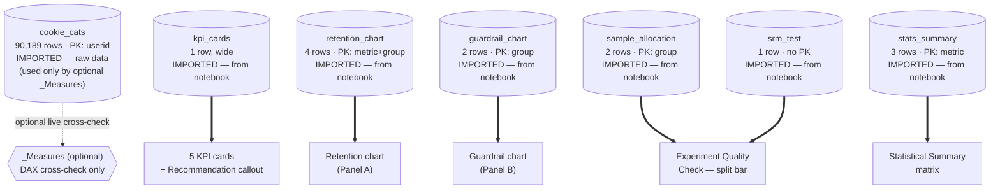

# Data Model — Cookie Cats A/B Test Power BI Report

This model has **no relationships between tables**. `cookie_cats` is the raw
row-level data (used only for optional live cross-check measures — see
`DAX_measures.md`). Every other table is a small, pre-shaped, pre-formatted CSV
that a visual binds to directly, with no DAX and no Power Query transforms
beyond setting data types. Nothing is joined by key — visuals bind to whichever
table has the number they need, and the version **slicer's cross-filter
interaction is turned off** for every reference table (see
`BUILD_INSTRUCTIONS.md` Step 6.5).

> **Trade-off worth knowing:** because the chart and KPI tables are static CSVs
> exported from the notebook, **refreshing `cookie_cats` does not update the
> charts.** If the underlying data or analysis changes, you must re-export
> `kpi_cards.csv`, `retention_chart.csv`, `guardrail_chart.csv`,
> `sample_allocation.csv`, and `stats_summary.csv` by hand. This was a
> deliberate simplification (drag-and-drop field mapping instead of DAX
> plumbing) — if you'd rather have the charts recompute live on refresh, see
> the "Optional: live equivalents" note at the end of this file.

---

## 1. `cookie_cats` — source fact table

- **Path:** `../data/raw/cookie_cats.csv`
- **Purpose:** row-level experiment data, one record per player. Not bound to
  any visual directly in this build — used only if you create the optional
  `_Measures` table for independent cross-checking against the CSVs below.
- **Grain:** one row per player. **Rows:** 90,189.
- **Imported from Python or computed in Power BI:** **Imported** — untouched.

| Column | Type | Description |
|---|---|---|
| `userid` | Whole Number | Unique player identifier |
| `version` | Text | `gate_30` (control) or `gate_40` (treatment) |
| `sum_gamerounds` | Whole Number | Total rounds played in the tracked window |
| `retention_1` | True/False | Returned on Day 1 |
| `retention_7` | True/False | Returned on Day 7 |

- **Primary key:** `userid` (verified unique in Phase 1).
- **Relationships:** none.

---

## 2. `kpi_cards` — all five KPI cards, one row

- **Path:** `data/kpi_cards.csv`
- **Purpose:** every value, caption, and badge string the 5 KPI cards and the
  Recommendation callout need, pre-formatted as a single row so each Card
  visual binds to one column with no measure. Also supplies the guardrail
  chart's caption text (Step 9) and the significance flags overlaid on the
  retention chart (Step 8), so the same wording can't drift between the KPI
  row and the charts that echo it.
- **Grain:** the whole report — exactly one row.
- **Rows:** 1
- **Imported from Python or computed in Power BI:** **Imported, verbatim** —
  hand-assembled from the notebook's Phase 2/3 printed output. Not
  recalculated in DAX.

| Column | Type | Description |
|---|---|---|
| `total_players` | Whole Number | 90,189 |
| `players_split_caption` | Text | "44,700 gate_30 · 45,489 gate_40" |
| `day1_delta_value` | Decimal (fraction) | Day-1 retention Δ, treatment − control, e.g. `-0.0059` → displays "−0.59%" |
| `day1_caption` | Text | Full rate + relative-diff sentence for the card |
| `day1_badge_text` | Text | Badge label incl. p-value |
| `day1_badge_status` | Text | `muted` — drives conditional badge color |
| `day7_delta_value` | Decimal (fraction) | Day-7 retention Δ |
| `day7_caption` | Text | Full rate + relative-diff sentence |
| `day7_badge_text` | Text | Badge label incl. p-value |
| `day7_badge_status` | Text | `critical` |
| `guardrail_delta_value` | Whole Number | Median-rounds Δ (rounds, not a fraction — do not format as Percentage) |
| `guardrail_caption` | Text | Full median + relative-diff sentence |
| `guardrail_badge_text` | Text | Badge label incl. p-value |
| `guardrail_badge_status` | Text | `good` |
| `guardrail_pvalue_caption` | Text | One-line Mann-Whitney readout, reused under the guardrail chart (Step 9) |
| `recommendation_value` | Text | "Keep Level 30" |
| `recommendation_caption` | Text | One-line rationale |

- **Primary key:** none needed — single row, grain is the whole report.
- **Relationships:** none.

---

## 3. `retention_chart` — tidy long format for the retention chart

- **Path:** `data/retention_chart.csv`
- **Purpose:** drives the Retention by Gate Placement clustered column
  (Step 8) directly — Axis = `metric`, Legend = `group`, Values =
  `retention_rate`. Replaces the earlier approach of unpivoting `cookie_cats`
  into a `retention_long` table plus a custom `AVERAGE()` measure; that
  approach is no longer used (see the note at the end of this file if you want
  it back for live refresh).
- **Grain:** one row per metric × group combination.
- **Rows:** 4
- **Imported from Python or computed in Power BI:** **Imported, verbatim**
  from the notebook's Phase 2 output.

| Column | Type | Description |
|---|---|---|
| `metric` | Text | `Day-1 Retention` or `Day-7 Retention` |
| `group` | Text | `Gate 30` or `Gate 40` |
| `retention_rate` | Decimal (fraction) | e.g. `0.4482` — format as **Percentage** in Power BI, displays "44.82%" |

- **Primary key:** composite — `metric` + `group`.
- **Relationships:** none.

---

## 4. `guardrail_chart` — two rows for the engagement chart

- **Path:** `data/guardrail_chart.csv`
- **Purpose:** drives the Gameplay Engagement column chart (Step 9) directly —
  Axis = `group`, Values = `median_rounds`. Replaces a `MEDIAN()` DAX measure
  chained through `CALCULATE`.
- **Grain:** one row per group.
- **Rows:** 2
- **Imported from Python or computed in Power BI:** **Imported, verbatim**
  from the notebook's Phase 3 output (the median, not the mean — deliberate,
  see `stats_summary` note below).

| Column | Type | Description |
|---|---|---|
| `group` | Text | `Gate 30` or `Gate 40` |
| `median_rounds` | Whole Number | Median `sum_gamerounds` for that group |

- **Primary key:** `group`.
- **Relationships:** none.

---

## 5. `sample_allocation` — group sizes and split

- **Path:** `data/sample_allocation.csv`
- **Purpose:** feeds the 100%-stacked bar in the Experiment Quality Check
  panel (Step 10).
- **Grain:** one row per experiment arm. **Rows:** 2
- **Imported from Python or computed in Power BI:** **Imported.**
- **Changed in this revision:** `pct_actual` and `pct_expected` were converted
  from percentage-style numbers (`49.56`) to decimal fractions (`0.4956`) so
  Power BI's native Percentage format displays them correctly without a manual
  workaround. `group` and `n_players` are unchanged.

| Column | Type | Description |
|---|---|---|
| `group` | Text | `Gate 30` or `Gate 40` |
| `n_players` | Whole Number | Player count in that arm |
| `pct_actual` | Decimal (fraction) | Actual share of total sample, e.g. `0.4956` → "49.56%" |
| `pct_expected` | Decimal (fraction) | Intended split, always `0.50` — used for the reference line |

- **Primary key:** `group`.
- **Relationships:** none.

---

## 6. `stats_summary` — pre-specified test results

- **Path:** `data/stats_summary.csv`
- **Purpose:** the three pre-registered inferential test results, feeding the
  Statistical Summary matrix (Step 11).
- **Grain:** one row per pre-specified metric. **Rows:** 3
- **Imported from Python or computed in Power BI:** **Imported, verbatim** —
  p-values, confidence intervals, and effect sizes came from a two-proportion
  z-test and a Mann-Whitney U test in the notebook; DAX has no equivalent for
  either.
- **Changed in this revision:** two text columns added, `ci_range` and
  `significant_label`, both pre-formatted per row so the matrix needs no
  Power Query concatenation step and no per-row calculated column for
  sentiment (the guardrail row's "No" means something reassuring, the
  retention rows' "Yes" means something concerning — these columns spell that
  out directly instead of relying on generic conditional-formatting logic).

| Column | Type | Description |
|---|---|---|
| `metric` | Text | `Day-1 Retention`, `Day-7 Retention`, or `Guardrail - Median Rounds` |
| `group_control` | Text | `Gate 30` (label only) |
| `group_treatment` | Text | `Gate 40` (label only) |
| `rate_control` | Decimal | Control value — proportion (0–1) for retention rows, a whole-number median for the guardrail row |
| `rate_treatment` | Decimal | Treatment value — same per-row unit caveat |
| `abs_diff` | Decimal | Treatment − control — percentage points for retention rows, rounds for the guardrail row |
| `rel_diff_pct` | Decimal | Relative % difference vs. control, stored **as a percentage number** (`-1.32` means −1.32%), not a fraction — do not apply Percentage format to this column |
| `ci_low` / `ci_high` | Decimal | 95% CI bounds on `abs_diff` — same per-row unit caveat as `abs_diff` |
| `ci_range` | Text | **New.** Pre-formatted CI string, unit-correct per row, e.g. `"[-1.24pp, +0.06pp]"` or `"[-1, 0] rounds"` |
| `test_name` | Text | `Two-proportion z-test` or `Mann-Whitney U` |
| `test_stat` | Decimal | z-statistic or U-statistic, matching `test_name` |
| `p_value` | Decimal | Two-sided p-value |
| `effect_size` | Decimal | Effect size value |
| `effect_size_name` | Text | `Cohen's h` or `Rank-biserial r` |
| `significant` | Text | `Yes` / `No` at α = 0.05 |
| `significant_label` | Text | **New.** Sentiment-correct label per row: "Not significant" / "Significant decline" / "No negative impact" |

> **Formatting gotcha, still applies:** `rate_control`/`rate_treatment`/
> `abs_diff`/`ci_low`/`ci_high` switch units between the retention rows
> (proportions) and the guardrail row (round counts) within the same column —
> do not apply a blanket Percentage format to the whole column in the matrix
> visual, or the guardrail row will render as a nonsense percentage. Use the
> plain-number format and let `ci_range`/`significant_label` (already
> unit-correct text) carry the meaning.

- **Primary key:** `metric`.
- **Relationships:** none.

---

## 7. `srm_test` — sample ratio mismatch & data quality

- **Path:** `data/srm_test.csv`
- **Purpose:** SRM chi-square result + data-quality summary, in the
  Experiment Quality Check panel (Step 10).
- **Grain:** the whole experiment. **Rows:** 1
- **Imported from Python or computed in Power BI:** **Imported, verbatim** —
  from `scipy.stats.chisquare` in Phase 1.
- **Unchanged in this revision** — `p_value` and `threshold` are already
  fraction-scaled by nature (probabilities, not percentages), so no unit fix
  was needed here.

| Column | Type | Description |
|---|---|---|
| `chi2_stat` | Decimal | Chi-square statistic |
| `p_value` | Decimal | SRM test p-value — format as plain **Number**, not Percentage |
| `threshold` | Decimal | Decision threshold used (0.01) |
| `verdict` | Text | `Borderline SRM` |
| `dq_missing_values` | Whole Number | Count found in Phase 1 (0) |
| `dq_duplicate_users` | Whole Number | Count found in Phase 1 (0) |
| `dq_out_of_range_values` | Whole Number | Count found in Phase 1 (0) |
| `note` | Text | One-line QA summary shown in the panel |

- **Primary key:** none — single-row table. Use `MIN()`/`MAX()` rather than
  `SELECTEDVALUE()` if you ever reference it from a measure, to be safe on a
  1-row table.
- **Relationships:** none.

---

## 8. `_Measures` — optional, model-only, no data

- **Purpose:** an empty table to hold the **optional** live cross-check
  measures from `DAX_measures.md` (counts, retention rates, medians computed
  directly from `cookie_cats`). Not required to render the report — build it
  only if you want a second, independently-computed set of numbers to diff
  against the CSVs above before an interview.
- **Imported from Python or computed in Power BI:** neither — empty container.
- **Primary key / relationships:** not applicable.

---

## Star-schema-style diagram

"Star-schema style" describes the **layout** (one hub, independent satellites),
not a real dimensional model — nothing is joined by a foreign key. Solid lines
below are Power Query derivations; dotted lines are "this visual reads this
table directly."



Plain-text fallback:

```
  cookie_cats (fact, 90,189 rows) --optional cross-check--> _Measures

  kpi_cards (1 row)        --> 5 KPI cards + Recommendation callout
  retention_chart (4 rows) --> Retention chart (Panel A)
  guardrail_chart (2 rows) --> Guardrail chart (Panel B)
  sample_allocation (2 rows)
  srm_test (1 row)         --> Experiment Quality Check panel
  stats_summary (3 rows)   --> Statistical Summary matrix

  No relationship lines exist anywhere in this model. Every table is either
  the raw fact table (unused by visuals directly) or a standalone, pre-shaped
  CSV bound straight to one visual. Slicer interaction is disabled (Edit
  Interactions) on every table except cookie_cats.
```

## Optional: live equivalents (if you want charts to update on refresh)

The static-CSV approach above trades live-refresh for build simplicity. If you
later want the retention and guardrail charts to recompute automatically when
`cookie_cats` changes, `DAX_measures.md` still documents how: unpivot
`cookie_cats` into a `retention_long` table (Power Query) and use
`AVERAGE(retention_long[retained])` for the retention chart, or
`MEDIAN(cookie_cats[sum_gamerounds])` split by `version` for the guardrail
chart. Swap the chart's data source back to those instead of `retention_chart`
/ `guardrail_chart` — the p-values and CI in `stats_summary`/`srm_test` still
cannot be made live (no rank-based or resampling test exists in DAX), so those
two tables stay static either way.

## Maintenance checklist

- [ ] If the notebook's analysis ever changes, **manually** re-export
      `kpi_cards.csv`, `retention_chart.csv`, `guardrail_chart.csv`,
      `sample_allocation.csv`, and `stats_summary.csv` — none of them update on
      a `cookie_cats` refresh.
- [ ] Keep `kpi_cards[recommendation_value]` and the Recommendation callout's
      heading (Step 12) in sync — both should read from the same cell, not be
      retyped independently.
- [ ] Never add a relationship between any reference table and `cookie_cats` —
      not needed for anything on the page, and would let the slicer start
      cross-filtering fixed statistical results.
- [ ] Any new visual reading `kpi_cards`, `stats_summary`, `sample_allocation`,
      or `srm_test` needs its slicer interaction set to **None**.
